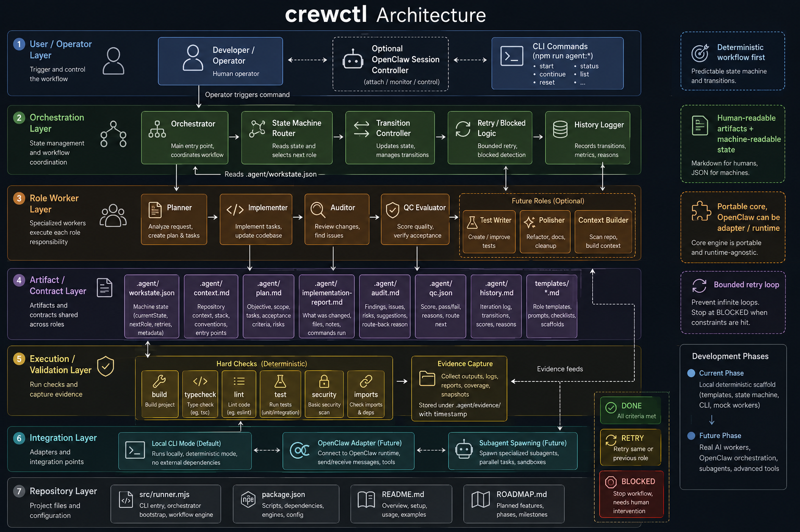

# Crewctl

[](https://github.com/caya8205-2/crewctl/actions/workflows/ci.yml)

State-machine based coding-agent orchestration scaffold.

## Quick Start

```bash
npm install -g crewctl
crewctl init
crewctl doctor
crewctl-mcp
```

For MCP-capable clients, configure the server command:

```json
{
  "mcpServers": {
    "crewctl": {
      "command": "crewctl-mcp"
    }
  }
}
```

Use MCP tools when available, and fall back to the `crewctl` CLI when a runtime only supports shell commands.

## What this is

`crewctl` is a lightweight workflow engine for coding agents.

Current focus:
- deterministic workflow first
- machine-readable state
- human-readable handoff artifacts
- role-based pipeline: planner -> implementer -> auditor -> qc
- portable core with runtime adapters; OpenClaw is the first intended adapter

Important: crewctl does **not** include built-in provider clients yet. There is no OpenAI/Anthropic/OpenRouter endpoint integration in the core code. Provider/model execution is currently expected to come from OpenClaw or another external runtime.

---



## Current status

Current phase: deterministic local pipeline with runtime adapter metadata and early OpenClaw handoff support.

Already implemented:
- repo scaffold
- `.agent/` artifact structure
- state machine file
- runner CLI
- lock guard for state mutations
- planner / implementer / auditor / QC deterministic executors
- role contract templates and role prompts
- history logging
- retry / block handling
- guarded `agent:complete-role` artifact validation
- structured check evidence in `.agent/check-results.json`
- runtime adapter/status prompt commands with OpenClaw compatibility
- Codex skill draft under `skills/crewctl/`
- smoke coverage for happy path, QC recovery, and manual handoff guard
- durable planning docs under `docs/`

Not implemented yet:
- real AI workers in code (only external/runtime handoff contract exists)
- rich configured checks for build/lint/typecheck
- full OpenClaw-native orchestration wrapper

## Repo structure

```txt
.agent/
  workstate.json
  context.md
  plan.md
  implementation-report.md
  audit.md
  qc.json
  history.md
src/
  runner.mjs
templates/
  planner.md
  implementer.md
  auditor.md
  qc.md
prompts/
  planner.md
  implementer.md
  auditor.md
  qc.md
examples/
  demo-happy-path.md
  demo-failure-path.md
skills/
  crewctl/
    SKILL.md
    agents/openai.yaml
tests/
  smoke.mjs
crewctl.config.json
README.md
ROADMAP.md
PROMPT_DIAGRAM.md
OPENCLAW_ADAPTER.md
OPENCLAW_WORKFLOW.md
REAL_WORKERS.md
package.json
```

## Commands

From this repository:

```bash
npm run agent:init
npm run agent:status
npm run agent:next
npm run agent:plan
npm run agent:implement
npm run agent:audit
npm run agent:qc
npm run agent:run-planner
npm run agent:run-implementer
npm run agent:run-auditor
npm run agent:run-qc
npm run agent:new-task -- "Build something"
npm run agent:continue
npm run agent:run
npm run agent:role-prompt
npm run agent:complete-role -- planner pass
npm run agent:runtime-adapter
npm run agent:openclaw-adapter
npm run agent:source-of-truth
npm run agent:checks
npm run skill:install-codex
npm run skill:probe
npm run check
npm run test:smoke
npm run test:mcp
```

## Install

```bash
npm install -g crewctl
crewctl init
crewctl doctor
crewctl install-skill codex
```

After package install:

```bash
crewctl init
crewctl doctor
crewctl status
crewctl runtime-adapter
crewctl install-skill codex
crewctl-mcp
```

## Core concept

- `workstate.json` = machine-readable workflow state
- Markdown / JSON artifacts = human-readable and machine-readable handoff outputs
- `runner.mjs` = deterministic transition helper and local executor entrypoint
- `.agent/run.lock` = mutation guard to reduce race conditions
- role contracts live in `templates/`
- actual AI workers can be plugged in later without changing the core artifact contract
- real worker handoff is documented in `REAL_WORKERS.md`
- runtime adapter integration is documented in `docs/RUNTIME_ADAPTERS.md`
- workflow/runtime/check defaults live in `crewctl.config.json`
- durable planning references live in `docs/SOURCE_OF_TRUTH.md`
- `agent:complete-role` validates role artifacts before accepting a `pass` result
- `agent:source-of-truth` exposes the current planning/reference anchor for external orchestrators

## Project Bootstrap

Initialize crewctl in another repository:

```bash
crewctl init --target /path/to/project --objective "Initial crewctl task"
```

Inspect whether a repository is crewctl-ready:

```bash
crewctl doctor --target /path/to/project
```

`init` creates `.agent/`, `crewctl.config.json`, `templates/`, and `prompts/`. It skips existing files unless `--force` is provided.

## MCP Server

Run the MCP server with:

```bash
crewctl-mcp
```

The server exposes crewctl as MCP tools so an orchestrator can avoid shell-command orchestration:

- `crewctl_doctor`
- `crewctl_init`
- `crewctl_status`
- `crewctl_runtime_adapter`
- `crewctl_role_prompt`
- `crewctl_complete_role`
- `crewctl_continue`
- `crewctl_checks`
- `crewctl_source_of_truth`

Use MCP tools when the runtime supports them. Use the CLI as the fallback command interface.

## Codex skill

This repo includes a project-local Codex skill package:

```txt
skills/crewctl/
  SKILL.md
  agents/openai.yaml
  scripts/probe.py
```

Install it into the local Codex skills directory when you want another Codex thread/project to discover it:

```bash
npm run skill:install-codex
```

The installer copies `skills/crewctl` to `$CODEX_HOME/skills/crewctl`, or `~/.codex/skills/crewctl` when `CODEX_HOME` is unset.

When installed as a package or linked globally, the same operation is available without a project-local `package.json`:

```bash
crewctl install-skill codex
```

## Workflow shape

```txt
INIT
 -> PLANNING
 -> READY_FOR_IMPLEMENT
 -> IMPLEMENTING
 -> READY_FOR_AUDIT
 -> AUDITING
 -> READY_FOR_QC
 -> QC
 -> DONE
```

Failure paths later:
- `AUDIT_FAILED`
- `QC_FAILED`
- `BLOCKED`

## OpenClaw-first integration

Crewctl exposes a runtime-neutral adapter contract through:

```bash
npm run agent:runtime-adapter
```

OpenClaw is the first intended real-worker runtime and keeps a compatibility alias:

```bash
npm run agent:openclaw-adapter
```

The intended OpenClaw flow is:

```txt
OpenClaw orchestrator
  -> npm run agent:role-prompt
  -> spawn role subagent
  -> worker updates artifact
  -> npm run agent:complete-role -- <role> pass/fail
  -> crewctl validates required artifact before accepting pass
  -> repeat until DONE/BLOCKED
```

See:
- `docs/RUNTIME_ADAPTERS.md`
- `skills/crewctl/SKILL.md`
- `OPENCLAW_WORKFLOW.md`
- `OPENCLAW_ADAPTER.md`
- `prompts/openclaw-orchestrator.md`
- `docs/SOURCE_OF_TRUTH.md`
- `docs/PUBLISHING_CHECKLIST.md`

## Long-term direction

This project can go in two compatible directions:

1. **Independent repo/tool**
   - portable orchestration engine
   - usable outside OpenClaw

2. **Runtime-integrated tool**
   - OpenClaw acts as the first orchestrator/adapter
   - Codex can integrate through a skill, plugin, or MCP wrapper
   - role workers can run as subagents
   - same artifact/state contract stays intact

## Next steps

See `ROADMAP.md` for phased development.
